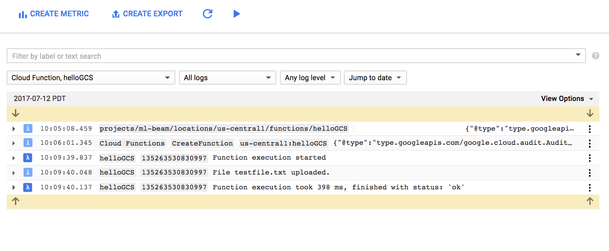
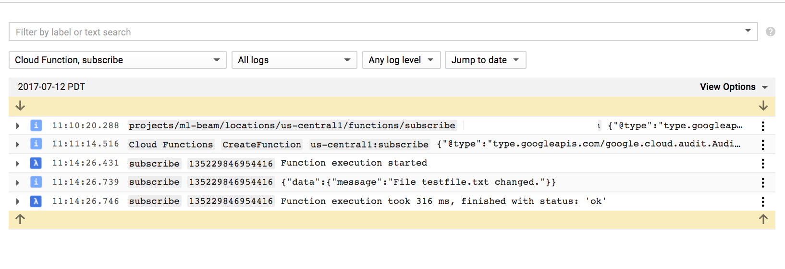

# GCS change to PubSub trigger

For more details, see:
* [Cloud Functions Hello World tutorial](https://cloud.google.com/functions/docs/quickstart)
* [Cloud Functions Hello World sample source code](https://github.com/GoogleCloudPlatform/nodejs-docs-samples/blob/master/functions/helloworld/index.js)
* [Cloud Functions Pub/Sub Sample](https://github.com/GoogleCloudPlatform/nodejs-docs-samples/tree/master/functions/pubsub)

#### Create a topic to which storage change events will be published

```bash
gcloud beta pubsub topics create [storage event topic name e.g. jbei-sync-notify-topic]
```

You will also need to update the value of `topic_name` in GCStoPubSub in index.js:

```python
const topic_name = 'the name of the topic you just created';
```

#### Create a storage bucket to which the cloud functions artifacts will be staged.

```bash
gsutil mb gs://[the bucket to which artifacts should be staged]
```

#### From the root of this directory, issue the following command:

```bash
gcloud beta functions deploy GCStoPubSub \
    --stage-bucket gs://[the bucket to which artifacts should be staged] \
    --trigger-bucket gs://[the bucket that should trigger messages]
```

You should see something like the following:

```bash
Copying file:///var/folders/lw/.../T/tmpbtyrMq/fun.zip [Content-Type=application/zip]...
/ [1 files][ 38.8 KiB/ 38.8 KiB]
Operation completed over 1 objects/38.8 KiB.
Deploying function (may take a while - up to 2 minutes).../
```

#### Upload a file to the monitored bucket

```bash
gsutil cp testfile.txt gs://[the bucket that should trigger messages]/
```

#### Examine logs to see a storage change event was logged

Examine recent logs to see the effect,

```bash
gcloud alpha functions get-logs GCStoPubSub
```

In the StackDriver logging console, set the filter to 'CloudFunction helloGCS' and you should see something similar to the following:



#### Create a subscription to the PubSub topic for storage changed events

```bash
gcloud alpha pubsub subscriptions create jbei-sync-notify-sub \  
    --topic=jbei-sync-notify-topic
```

#### Receive the object changed message via PubSub

We can verify messages are being issued to the desired pubsub topic by deploying a secondary cloud function that is triggered by messages on that topic and in response logs their content to cloud logging. Deploying that function is as follows:

```bash
gcloud beta functions deploy subscribe \
    --stage-bucket gs://[the bucket to which artifacts should be staged] \
    --trigger-topic [your storage change topic]

e.g.

beta functions deploy subscribe --stage-bucket gs://ml-beam-trigger-fn \
    --trigger-topic jbei-sync-notify-topic
```

Inspecting StackDriver logs for the `subscribe` function we should be able to confirm our function is working



Or, from the command-line

```bash
gcloud alpha functions get-logs subscribe
```

Indeed make sure that you have created a change in the monitored bucket since deploying both the notifier and the dev responder - otherwise we shouldn't anticipate anything being logged.
